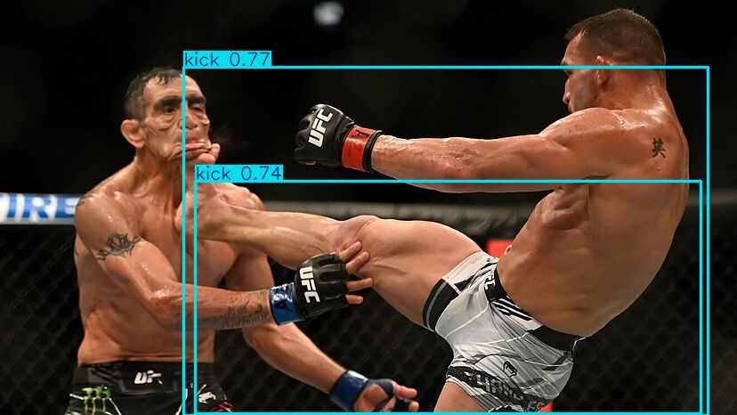

# MMA Fighting Action Detection using YOLOv8

  

## 📌 Overview
This project utilizes **YOLOv8** for real-time **MMA fighting action detection**, classifying actions into:  
- 🥋 **Grappling** (0)  
- 🦵 **Kick** (1)  
- ✊ **Punch** (2)  
- 🧍 **Stand** (3)  

It is trained on a custom dataset and can be used for **video analysis**, **sports analytics**, and **real-time fight detection**.  

## 🚀 Features
- **Real-time action detection** from videos and images  
- **Custom YOLOv8 model training** for MMA fighting  
- **Fast and accurate predictions**  
- Supports **live webcam inference**  

## 📦 Installation
Clone the repository and install dependencies:  
```bash
git clone https://github.com/alihassanml/MMA-Fighting-Object-Detection-YOLOv8.git
cd MMA-Fighting-Object-Detection-YOLOv8
pip install -r requirements.txt
```

## 🔧 Training the Model
To train YOLOv8 on your dataset, run:  
```bash
yolo task=detect mode=train model=yolov8n.pt data=mma.yaml epochs=50 imgsz=640
```
Adjust parameters as needed for **epochs**, **batch size**, and **learning rate**.

## 🎯 Running Inference
To test on an image:  
```bash
yolo task=detect mode=predict model=runs/detect/train/weights/best.pt source=your_image.jpg
```
For video:  
```bash
yolo task=detect mode=predict model=runs/detect/train/weights/best.pt source=your_video.mp4
```

## 📊 Results & Performance
- Achieved **high accuracy** in action detection  
- Works in **real-time on GPU**  
- Supports **live video streaming**  

## 🤖 Deployment
You can deploy this model using **FastAPI**, **Flask**, or integrate it into a **web application** for real-time fight analysis.  

## 📌 Notebook
You can check the training and implementation details in this **[Kaggle Notebook](https://www.kaggle.com/code/alihassanml/mma-fighting-classfication-yolov8/notebook)**.  

## 🙌 Contributing
Feel free to open issues or submit pull requests to improve this project!  

## 📜 License
This project is **open-source** under the **MIT License**.  

---
🔥 **Developed by [Ali Hassan](https://github.com/alihassanml)**  
```

